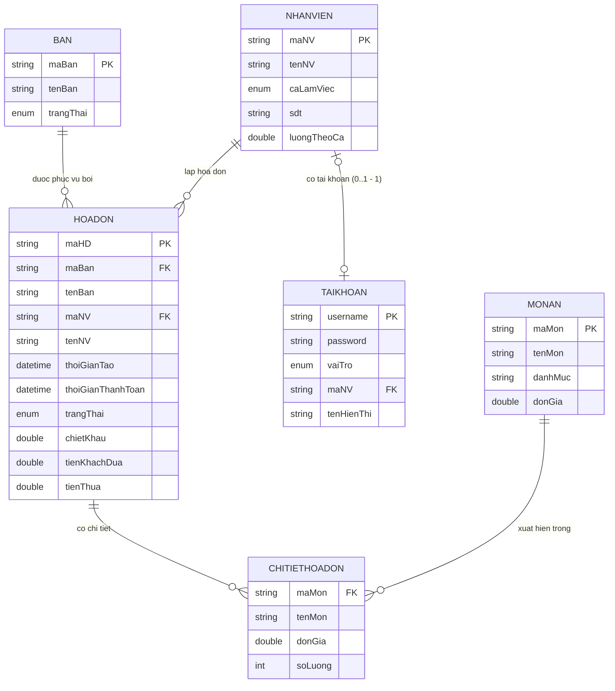

# ERD – Quản Lý Nhà Hàng

Sơ đồ dưới đây dùng cú pháp Mermaid (render được trên GitHub, VS Code Markdown Preview, Obsidian…).

## Quan hệ tóm tắt

| # | Bảng A | Cardinality | Bảng B | Mô tả |
|---|---|---|---|---|
| 1 | `BAN` | 1 → 0..N | `HOADON` | Một bàn có thể phát sinh nhiều hóa đơn theo thời gian |
| 2 | `NHANVIEN` | 1 → 0..N | `HOADON` | Một nhân viên lập được nhiều hóa đơn |
| 3 | `HOADON` | 1 → 1..N | `CHITIETHOADON` | Mỗi hóa đơn có ít nhất một dòng chi tiết khi thanh toán |
| 4 | `MONAN` | 1 → 0..N | `CHITIETHOADON` | Một món ăn có thể xuất hiện trong nhiều hóa đơn |
| 5 | `NHANVIEN` | 1 → 0..1 | `TAIKHOAN` | Một nhân viên có thể có một tài khoản đăng nhập (admin có `maNV = ""`) |
